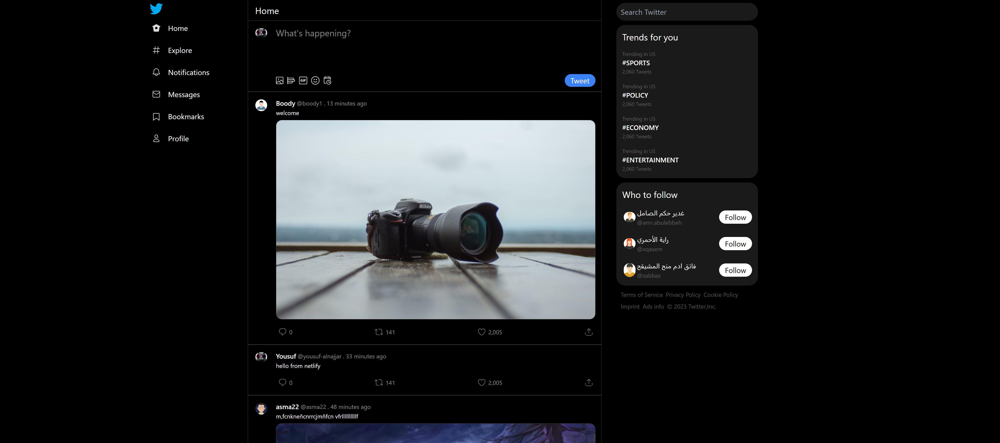

# Twitter Clone 

A Twitter clone project built with React, Tailwind CSS, React Router DOM, React Redux, Redux Toolkit, Axios, and React Infinite Scroll Component.

**Live Demo**: [Twitter Clone Demo](https://twitter-clone-yossef.vercel.app/ target="_blank")

## Table of Contents

- [Introduction](#introduction)
- [Technologies Used](#technologies-used)
- [Features](#features)
- [Getting Started](#getting-started)
- [Usage](#usage)

## Introduction

This project is a Twitter clone that replicates some of the core features of the popular social media platform. It allows users to sign in, create tweets, view other users' profiles, comment on tweets, and more. The project is built using modern web development technologies and aims to provide a learning resource for React and Redux enthusiasts.

## Technologies Used

The following technologies were used to build this Twitter clone project:

- React
- Tailwind CSS
- React Router DOM
- React Redux
- Redux Toolkit
- Axios
- React Infinite Scroll Component

## Features

This Twitter clone project includes the following features:

1. **Infinite Scroll:** Users can scroll through their feed infinitely, loading more tweets as they reach the end of the page.

2. **Sign In and Sign Up:** Users can create accounts, sign in, and sign out securely.

3. **Create New Tweet:** Users can compose and post new tweets, complete with text and optional media attachments.

4. **View User Profiles:** Users can click on a user's profile to see their tweets and follow them.

5. **Comment on Tweets:** Users can comment on any tweet, and the comments will be displayed below the tweet.

6. **Edit Your Tweets:** Authenticated users can edit their own tweets if needed.

7. **Delete Your Tweets:** Authenticated users can delete their own tweets if desired.

## Getting Started

To get started with this project, follow these steps:

1. Clone the repository: `git clone https://github.com/yossefelnajjar/twitter-clone.git`

2. Navigate to the project directory: `cd twitter-clone`

3. Install the project dependencies: `npm install`

4. Start the development server: `npm run dev`

5. Open your browser and access the application at `http://localhost:5173`

## Usage

Feel free to use this project as a reference for learning or as a starting point for your own Twitter clone. You can explore the code, customize it, and add additional features as needed.
